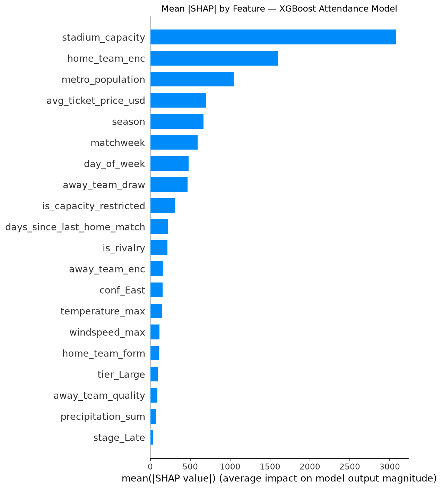
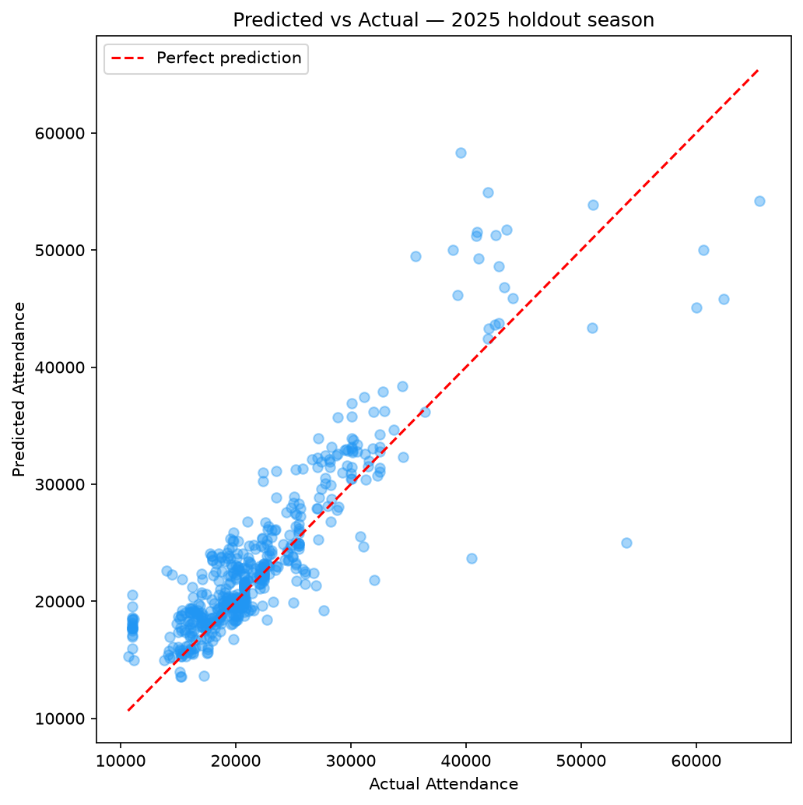

# MLS Attendance & Ticket Revenue Forecasting Dashboard


<!-- TODO: Replace YOUR_GITHUB_USERNAME above with your actual GitHub username before pushing -->

An end-to-end sports analytics portfolio project that forecasts Major League Soccer match attendance and estimated ticket revenue using machine learning (XGBoost + Linear Regression), SHAP explainability, and an interactive Plotly Dash dashboard.

---

## Business Question

> **"What factors drive MLS match attendance, and how can we accurately forecast attendance and estimated ticket revenue for future matches to support stadium operations, marketing spend allocation, and dynamic pricing decisions?"**

This project answers that question by building a complete analytical pipeline — from raw data collection through predictive modeling to an interactive stakeholder dashboard — designed to demonstrate the kind of work a Business Intelligence team at an MLS club would produce.

---

## Tech Stack

| Layer | Tools |
|---|---|
| Language | Python 3.11+ |
| Data Wrangling | pandas, numpy |
| Machine Learning | scikit-learn, XGBoost |
| Explainability | SHAP |
| Database / SQL | SQLite, SQLAlchemy |
| Dashboard | Plotly Dash, dash-bootstrap-components |
| Statistical Analysis | statsmodels |
| Visualization | Plotly, seaborn, matplotlib |
| CI/CD | GitHub Actions |

---

## Setup Instructions

### Run the dashboard only
```bash
pip install -r requirements.txt
python src/dashboard.py
```
Then open [http://127.0.0.1:8050](http://127.0.0.1:8050) in your browser.

### Reproduce the full analysis pipeline
```bash
pip install -r requirements-dev.txt
python src/collect_data.py      # Collect & cache raw data
python src/clean_data.py        # Clean, engineer features
python src/sql_loader.py        # Load into SQLite, run SQL analysis
python src/model.py             # Train XGBoost + Linear Regression models
python src/dashboard.py         # Launch interactive dashboard
```

> **Note:** `requirements.txt` installs runtime dependencies for the dashboard only. `requirements-dev.txt` includes everything needed to reproduce the full pipeline (data collection, EDA notebook, model training).

---

## Project Structure

```
mls-attendance-forecasting/
├── README.md
├── .gitignore
├── requirements.txt            # Dashboard runtime dependencies
├── requirements-dev.txt        # Full pipeline dependencies
├── .github/
│   └── workflows/
│       └── ci.yml              # GitHub Actions CI pipeline
├── data/
│   ├── raw/
│   │   ├── stadium_market.csv          # Stadium & market reference data
│   │   └── stadium_market_provenance.json  # Data collection methodology log
│   └── processed/
│       ├── mls_matches_clean.csv       # Cleaned match-level dataset
│       ├── model_features.csv          # Final modeling feature table
│       ├── flagged_rows.csv            # Rows removed/modified during cleaning
│       ├── data_dictionary.md          # Full column-level documentation
│       └── sql_results/                # CSV exports from SQL queries
├── sql/
│   ├── 01_create_schema.sql            # Table definitions
│   ├── 02_exploratory_queries.sql      # Business intelligence queries
│   ├── 03_feature_queries.sql          # Modeling feature export query
│   └── 04_dashboard_queries.sql        # Summary queries for the EDA notebook & dashboard
├── notebooks/
│   ├── build_eda.py                    # Generates and executes eda.ipynb
│   └── eda.ipynb                       # Exploratory data analysis report
├── src/
│   ├── __init__.py
│   ├── collect_data.py                 # Data collection (ASA API, Wikipedia, Census, weather)
│   ├── clean_data.py                   # Data cleaning & feature engineering
│   ├── feature_engineering.py          # Shared feature construction functions
│   ├── sql_loader.py                   # SQLite loader & query runner
│   ├── model.py                        # Model training, evaluation, forecasting
│   └── dashboard.py                    # Plotly Dash interactive dashboard
├── models/
│   └── .gitkeep                        # Model .pkl files excluded (run model.py to regenerate)
├── reports/
│   ├── executive_summary.md            # Stakeholder-ready executive report
│   └── figures/                        # SHAP plots, residual analysis charts
└── assets/
    └── (dashboard static assets)
```

---

## Data Sources

| Source | Description | Collection Method |
|---|---|---|
| [American Soccer Analysis (ASA)](https://www.americansocceranalysis.com/) | MLS match-level data: attendance, scores, team IDs, 2012–present | `itscalledsoccer` Python package |
| [Wikipedia](https://en.wikipedia.org/) | Home-stadium capacity for each MLS club (fallback when ASA lists no capacity for a venue) | `requests` + `BeautifulSoup` scraper (with hardcoded fallback) |
| [U.S. Census Bureau API](https://api.census.gov/) | 2023 metro area population estimates | Census PEP API (free, no key required) |
| [Open-Meteo](https://open-meteo.com/) | Historical match-day weather (temperature, precipitation, wind) | Free archive API (no key required) |

All collection methods and fallback decisions are logged to `data/raw/stadium_market_provenance.json`.

---

## Data Notes

- **2020 excluded:** The 2020 MLS season was played in a COVID bubble with no fans; these records are structurally incomparable and were removed entirely before modeling.
- **2021 flagged as capacity-restricted:** The 2021 season included stadium-specific attendance caps as COVID protocols relaxed. All 2021 records are retained in the dataset with an `is_capacity_restricted = 1` flag so the model can learn to account for suppressed attendance figures.
- **Dates are local:** ASA reports kickoff in UTC; match dates are converted to the home market's local calendar day so day-of-week and weather refer to the day the match was played.
- **Venue is per match:** stadium name, listed capacity and coordinates come from the venue each match was actually played in (ASA stadium table), not one fixed stadium per club. Listed capacity is often a reduced soccer configuration, so reported attendance can exceed it and is never capped.
- **Weather is observed:** daily maximum temperature, precipitation and wind at the venue come from the Open-Meteo historical archive. `data/raw/weather_cache.json` is committed so reruns only request weather for new matches.
- **Estimates:** ticket prices are estimated averages (FC Cincinnati and Chivas USA use a $55 placeholder) and metro populations are hardcoded 2023 figures, so revenue numbers are directional.

---

## Key Findings

Based on 5,403 matches, 2013–2026 (2020 excluded; 2026 through October 1).

- **League average attendance is 21,345 per match** (median 19,796); the peak season was 2024 at 23,353.
- **The home club matters far more than the visitor:** Atlanta United FC leads at 47,821 per home match, while FC Dallas is lowest among current clubs at 15,207.
- **Playoff matches draw 17.8% more than regular-season matches** — 8.1% more when the same club is compared with its own regular season.
- **Marquee opponents move the needle:** Inter Miami CF's away matches since August 2023 have drawn 58% more than the host's season average (partly because hosts move those games to bigger stadiums); designated rivalries draw about 15% more.
- **Weekends matter more than season timing:** weekend matches draw 8.1% more than weekday matches; summer (Jun–Aug) draws 4.2% more than spring (Mar–May).
- **Weather has a modest effect on announced attendance:** versus the same club's season average, matches below 40°F draw 3.8% less and rainy days 1.9% less; heat of 90°F+ shows no effect.
- **Top model drivers (SHAP):** `stadium_capacity`, `home_team_enc`, `metro_population`.

See [reports/executive_summary.md](reports/executive_summary.md) for recommendations and data limitations.

---

## Model Performance

Out-of-time evaluation: trained on 4,480 matches before 2025, tested on the full 2025 season (524 matches).

| Model | Test MAE | R² |
|---|---|---|
| Naive benchmark (team historical average) | 3,393 | 0.410 |
| Linear Regression | 4,083 | 0.334 |
| XGBoost | 2,461 | 0.735 |

- XGBoost reduces MAE by 39.7% versus Linear Regression and 27.5% versus the naive benchmark.
- The 80% quantile prediction interval covered 79.6% of 2025 matches, close to its nominal level.
- The single most valuable match-level feature is `away_team_draw` — how much the visiting club has recently lifted crowds on the road. Without the away-team features, R² on the same holdout is about 0.58.

---

## How to Run

```bash
# Run the dashboard (models must be trained first)
python src/model.py       # trains models (~1 min)
python src/dashboard.py   # starts dashboard at http://localhost:8050
```

---

## Screenshots

| SHAP Summary | Predicted vs Actual |
|---|---|
|  |  |

---

## License

This project is intended for portfolio and educational purposes. MLS attendance data is publicly available via the American Soccer Analysis API.

---

*Built with Python, XGBoost, and Plotly Dash | Data: American Soccer Analysis, Open-Meteo, Wikipedia, U.S. Census Bureau*
